# Zynq SHA-512/256 MCDMA HLS Application

This repository contains a Zynq UltraScale+ MPSoC based hardware/software project for validating four SHA-512/256 HLS accelerator IP instances using AXI Multi-Channel DMA on the Ultra96-V2 development board.

The design uses the Processing System to configure the AXI MCDMA and SHA HLS IPs through AXI-Lite. Input data is transferred from DDR to the selected SHA IP through the MCDMA MM2S path, and the 256-bit SHA-512/256 digest is returned to DDR through the MCDMA S2MM path.

The repository is intentionally organized with two application styles:

- `Application/` contains the API-based modular application structure.
- `Application_1/` contains the same application flow in a single-file `main.c` structure.

The folder structure is kept unchanged.

---

## Key Features

- SHA-512/256 hardware accelerator generated through Vitis HLS.
- Four SHA HLS IP instances integrated in the Vivado block design.
- AXI MCDMA based data movement between DDR and accelerator IPs.
- Four MM2S channels and four S2MM channels used for selected-IP testing.
- AXI4-Stream Switch routing based on `TDEST` for TX path selection.
- AXI-Lite register control for MCDMA and all SHA IPs.
- Standalone Vitis application running on `psu_cortexa53_0`.
- UART-based validation at 115200 baud rate.
- All four selected SHA IP tests verified with `PASS` result.

---

## Project Status

| Item | Status |
|---|---|
| Vivado block design | Completed |
| Synthesis | Completed |
| Implementation | Completed |
| Timing | Met |
| Vitis platform generation | Completed |
| 4 SHA IP hardware integration | Completed |
| AXI MCDMA TX/RX channel testing | Completed |
| `test_0` result | PASS |
| `test_1` result | PASS |
| `test_2` result | PASS |
| `test_3` result | PASS |

---

## Target Platform and Tools

| Item | Details |
|---|---|
| Board | Avnet Ultra96-V2 Single Board Computer |
| Device family | Zynq UltraScale+ MPSoC |
| Processor used | `psu_cortexa53_0` |
| Hardware design tool | Xilinx Vivado |
| HLS tool | Vitis HLS |
| Software tool | Vitis Unified IDE |
| BSP/OS | Standalone |
| UART baud rate | 115200 |

> Note: This project README describes the standalone Vitis application flow. It does not include a PetaLinux boot flow.

---

## Repository Structure

```text
Zynq-SHA-512_256-MCDMA-HLS-Application/
│
├── .gitignore
├── README.md
│
├── Application/
│   ├── .gitignore
│   ├── _ide/
│   ├── app_component/
│   │   ├── .gitignore
│   │   ├── _ide/
│   │   ├── compile_commands.json
│   │   ├── vitis-comp.json
│   │   └── src/
│   │       ├── .cache/
│   │       ├── .clangd
│   │       ├── CMakeLists.txt
│   │       ├── Empty_applicationExample.cmake
│   │       ├── README.txt
│   │       ├── UserConfig.cmake
│   │       ├── app.yaml
│   │       ├── compile_commands.json
│   │       ├── lscript.ld
│   │       ├── main_user.c
│   │       ├── sha_api.c
│   │       ├── sha_api.h
│   │       └── sha_config.h
│   └── platform/
│       ├── .gitignore
│       ├── vitis-comp.json
│       ├── hw/
│       │   ├── design_1_wrapper.xsa
│       │   └── sdt/
│       ├── psu_cortexa53_0/
│       │   └── standalone_psu_cortexa53_0/
│       ├── resources/
│       └── zynqmp_fsbl/
│
├── Application_1/
│   ├── .gitignore
│   ├── _ide/
│   ├── app_component/
│   │   ├── .gitignore
│   │   ├── _ide/
│   │   ├── compile_commands.json
│   │   ├── vitis-comp.json
│   │   └── src/
│   └── platform/
│       ├── .gitignore
│       ├── vitis-comp.json
│       ├── hw/
│       ├── psu_cortexa53_0/
│       ├── resources/
│       └── zynqmp_fsbl/
│
├── HLS/
│   ├── .gitignore
│   ├── _ide/
│   └── SHA_256_HLS_Component/
│       ├── .cache/
│       ├── .gitignore
│       ├── compile_commands.json
│       ├── hls_config.cfg
│       ├── tb.cpp
│       ├── test.cpp
│       ├── test.hpp
│       ├── testcases.dat
│       ├── vitis-comp.json
│       └── test/
│           ├── hls/
│           ├── reports/
│           ├── test.hlscompile_summary
│           ├── test.hlsrun_cosim_summary
│           ├── test.hlsrun_csim_summary
│           ├── test.hlsrun_impl_summary
│           ├── test.hlsrun_package_summary
│           └── test.zip
│
├── Images/
│   ├── Application_Result/
│   │   ├── Test_0_Result.png
│   │   ├── Test_1_Result.png
│   │   ├── Test_2_Result.png
│   │   └── Test_3_Result.png
│   └── Vivado_Design/
│       ├── AXI_Switch_0_Config.png
│       ├── AXI_Switch_0_Routing.png
│       ├── AXI_Switch_1_Config.png
│       ├── AXI_Switch_1_Routing.png
│       ├── Address_Editor_Network_0.png
│       ├── Address_Editor_Network_1.png
│       ├── Address_Map_Network_1.png
│       ├── Block_Design.png
│       ├── MCDMA_Config.png
│       ├── Network_0.png
│       ├── PS_PL_Config.png
│       ├── Platform_Config.png
│       └── Project_Summary.png
│
└── Vivado/
    └── project_1/
        ├── design_1_wrapper.xsa
        ├── project_1.cache/
        ├── project_1.gen/
        ├── project_1.hw/
        ├── project_1.runs/
        ├── project_1.srcs/
        ├── project_1.xpr
```

---

## Hardware Architecture

The hardware design contains four SHA-512/256 HLS IP blocks connected with one AXI MCDMA IP. The PS controls the MCDMA and SHA IP AXI-Lite registers. The MM2S stream is routed to the selected SHA IP using AXI4-Stream Switch 0. The digest stream from the selected SHA IP is returned to the MCDMA S2MM path through AXI4-Stream Switch 1.

### High-Level Block Diagram

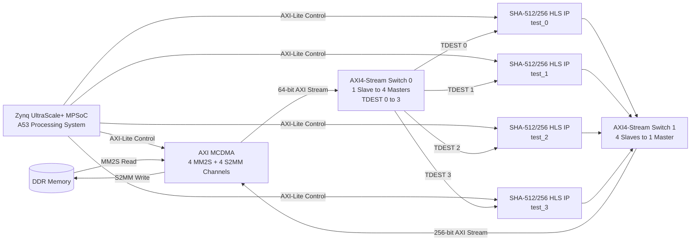

Reference Vivado block design:

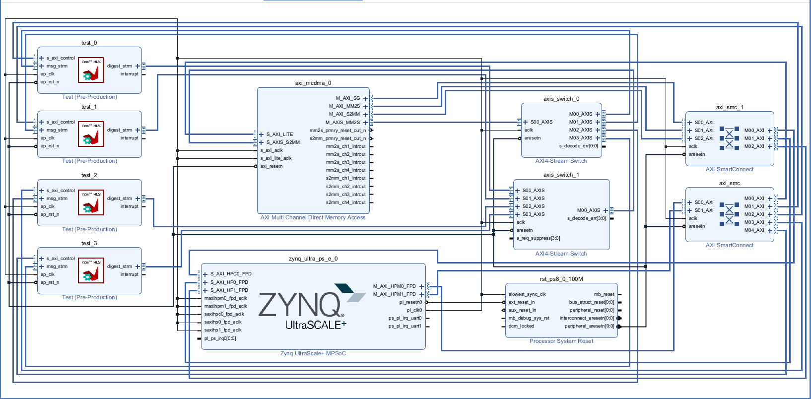

---

## Main Hardware Components

### 1. SHA-512/256 HLS IP

Each SHA IP is generated using Vitis HLS and exposes:

- AXI-Lite control interface for register programming.
- AXI4-Stream input interface for message data.
- AXI4-Stream output interface for 256-bit digest data.
- `ap_clk` and `ap_rst_n` for clock and reset.

The application programs each selected SHA IP with:

- Message length.
- Destination ID.
- Start/control signal.

### 2. AXI MCDMA

The AXI MCDMA is used for DMA-based movement of data between DDR and the SHA IP stream interfaces.

| Parameter | Value |
|---|---|
| Read/MM2S channels | 4 |
| Write/S2MM channels | 4 |
| MM2S memory-map data width | 64-bit |
| MM2S stream data width | 64-bit |
| S2MM memory-map data width | 256-bit |
| S2MM stream data width | 256-bit |
| Address width | 32-bit |
| Buffer length register width | 14-bit |
| Queue scheduler | WRR |

Reference image:

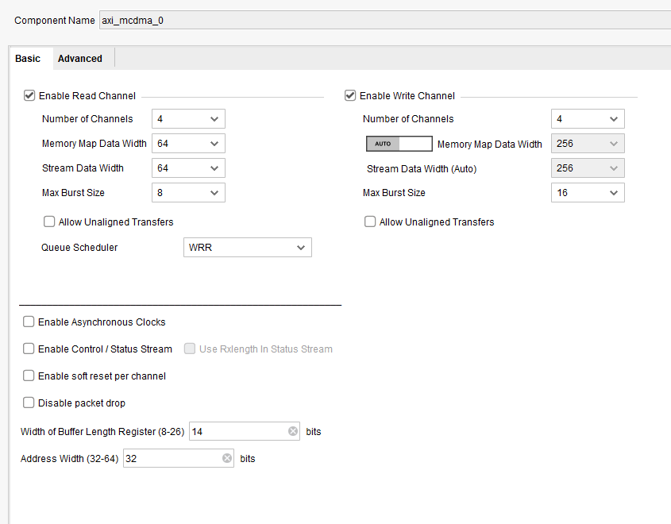

### 3. AXI4-Stream Switch 0: TX Path

AXI4-Stream Switch 0 routes the MCDMA MM2S output stream to one of the four SHA IPs using the `TDEST` value.

| Parameter | Value |
|---|---|
| Slave interfaces | 1 |
| Master interfaces | 4 |
| TDATA width | 8 bytes / 64-bit |
| TDEST width | 2-bit |
| Control register routing | Disabled |

Routing configuration:

| TDEST | Routed Output | Connected SHA IP |
|---|---|---|
| 0 | M00_AXIS | `test_0` |
| 1 | M01_AXIS | `test_1` |
| 2 | M02_AXIS | `test_2` |
| 3 | M03_AXIS | `test_3` |

Reference images:

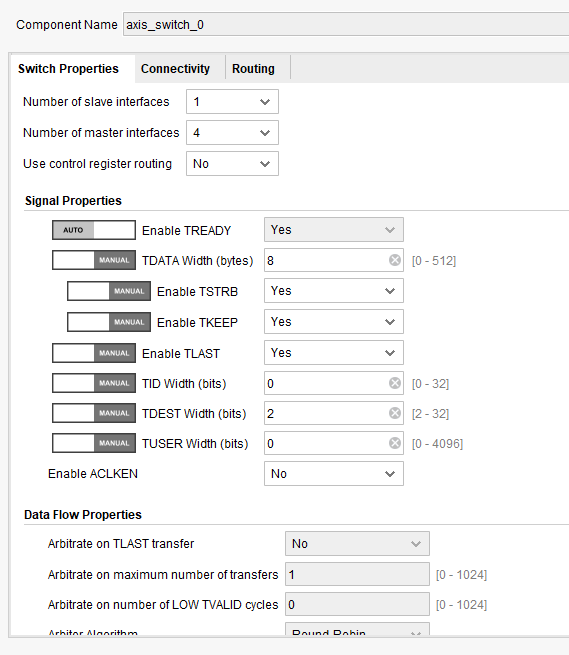

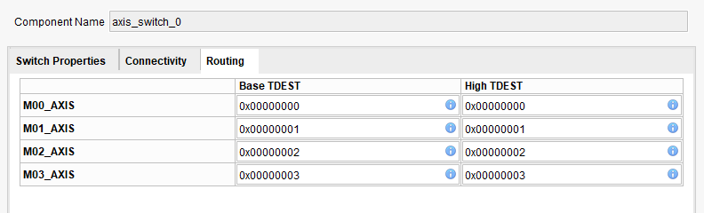

### 4. AXI4-Stream Switch 1: RX Path

AXI4-Stream Switch 1 combines the digest streams from four SHA IPs into one MCDMA S2MM stream.

| Parameter | Value |
|---|---|
| Slave interfaces | 4 |
| Master interfaces | 1 |
| TDATA width | 32 bytes / 256-bit |
| TDEST width | 2-bit |
| Control register routing | Disabled |
| M00_AXIS route range | TDEST 0 to 3 |

Reference images:

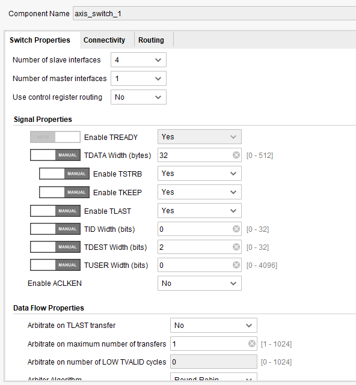

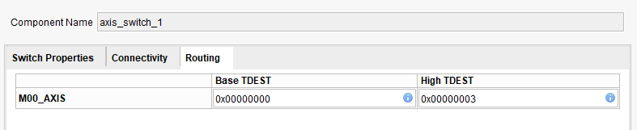

---

## Address Map

### AXI-Lite Register Address Map

| Peripheral | Base Address | Range | Purpose |
|---|---:|---:|---|
| AXI MCDMA | `0xA000_0000` | 64 KB | DMA control and status registers |
| SHA IP `test_0` | `0xA001_0000` | 64 KB | SHA IP 0 AXI-Lite control |
| SHA IP `test_1` | `0xA002_0000` | 64 KB | SHA IP 1 AXI-Lite control |
| SHA IP `test_2` | `0xA003_0000` | 64 KB | SHA IP 2 AXI-Lite control |
| SHA IP `test_3` | `0xA004_0000` | 64 KB | SHA IP 3 AXI-Lite control |

Reference images:

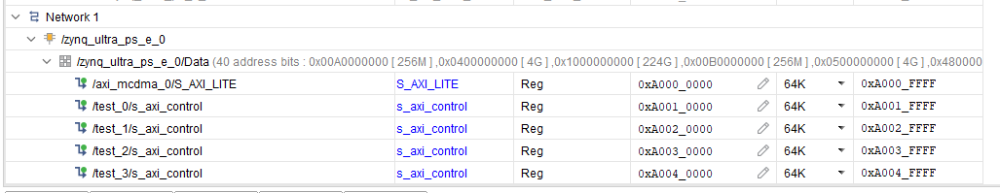

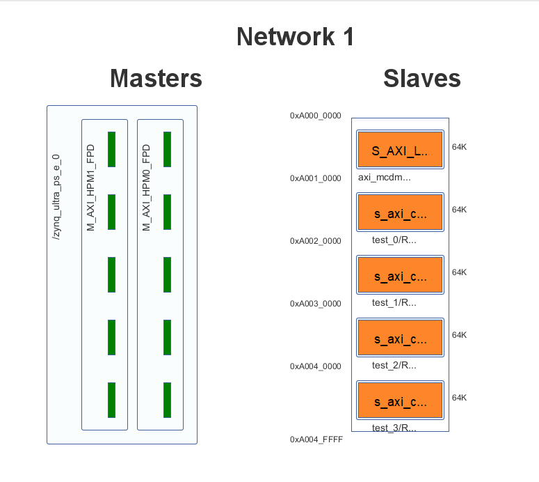

### DDR Access Network

The MCDMA master interfaces access DDR through PS high-performance interfaces. The design uses DDR memory regions for DMA buffer descriptors and TX/RX data buffers.

Reference images:

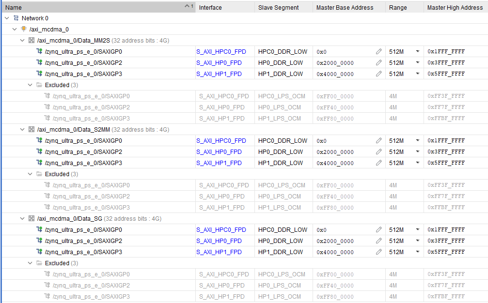

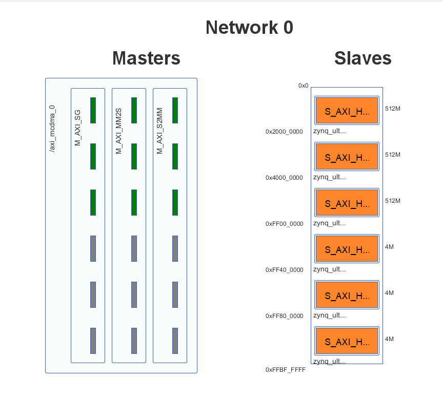

---

## Vitis Standalone Platform Configuration

The Vitis standalone application uses the hardware platform exported from Vivado through the XSA file.

Exported XSA location:

```text
Vivado/project_1/design_1_wrapper.xsa
```

The standard input and output are configured through the PS UART.

Reference images:

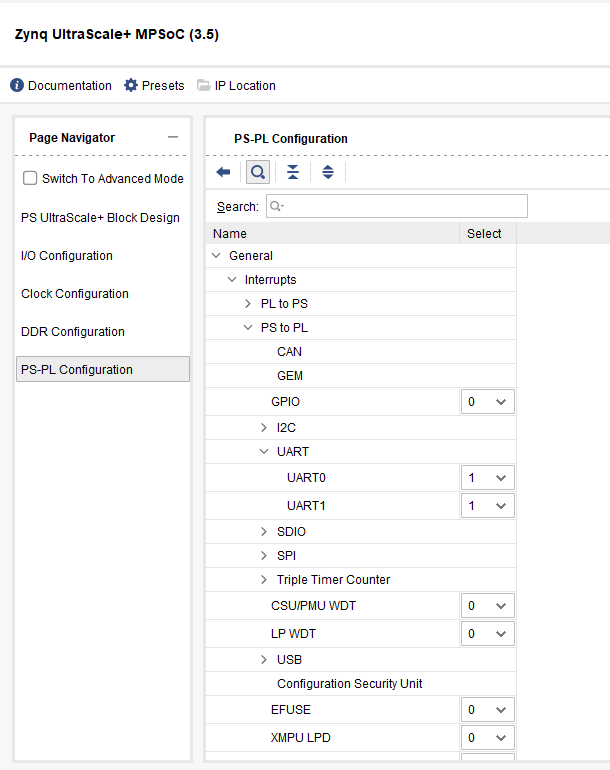

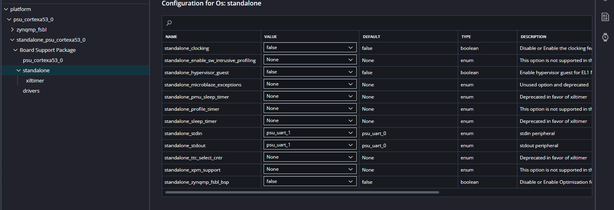

---

## Software Application Structure

### API-Based Application

The modular application is located in:

```text
Application/app_component/src/
```

Important files:

| File | Purpose |
|---|---|
| `main_user.c` | Main application flow |
| `sha_api.c` | SHA/MCDMA API implementation |
| `sha_api.h` | API function declarations |
| `sha_config.h` | Base addresses, channel IDs, buffer addresses, constants |
| `lscript.ld` | Linker script |

### Single-File Application

The single-file version is located in:

```text
Application_1/app_component/src/
```

This version keeps the same logic in one `main.c` file for direct testing and easier debugging.

---

## Software Execution Flow

Both application structures follow the same execution sequence.

```text
1. Initialize platform and UART.
2. Initialize AXI MCDMA.
3. Select SHA IP test_0 / test_1 / test_2 / test_3.
4. Select matching TX channel, RX channel, and TDEST value.
5. Prepare TX buffer with input message.
6. Prepare RX buffer for SHA digest.
7. Create TX and RX BD rings for the selected channel.
8. Arm RX channel first.
9. Program SHA IP AXI-Lite registers:
   - message length
   - destination ID
   - start signal
10. Start TX transfer.
11. Wait for TX completion.
12. Wait for RX completion.
13. Read received digest from RX buffer.
14. Compare received digest with expected SHA-512/256 digest.
15. Print PASS or FAIL on UART terminal.
```

---

## Test Configuration

| Test | SHA IP | TX Channel | RX Channel | TDEST | SHA Base Address |
|---|---|---:|---:|---:|---:|
| `test_0` | SHA IP 0 | 1 | 1 | 0 | `0xA001_0000` |
| `test_1` | SHA IP 1 | 2 | 2 | 1 | `0xA002_0000` |
| `test_2` | SHA IP 2 | 3 | 3 | 2 | `0xA003_0000` |
| `test_3` | SHA IP 3 | 4 | 4 | 3 | `0xA004_0000` |

Input message used for validation:

```text
abc
```

Expected SHA-512/256 digest for `abc`:

```text
53048E2681941EF99B2E29B76B4C7DABE4C2D0C634FC6D46E0E2F13107E7AF23
```

---

## Hardware Validation Results

All four selected-IP tests passed successfully.

| Test | Selected IP | TDEST | TX Status | RX Status | Digest Match | Final Result |
|---|---|---:|---|---|---|---|
| `test_0` | `test_0` | 0 | Done | Done | Yes | PASS |
| `test_1` | `test_1` | 1 | Done | Done | Yes | PASS |
| `test_2` | `test_2` | 2 | Done | Done | Yes | PASS |
| `test_3` | `test_3` | 3 | Done | Done | Yes | PASS |

### UART Output Screenshots

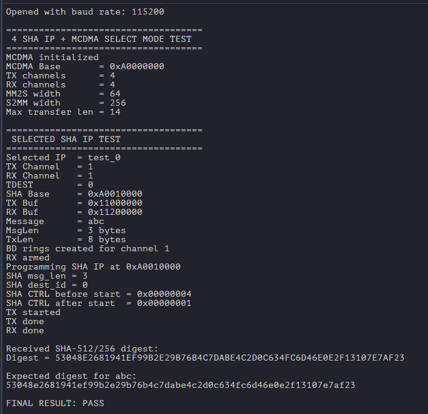

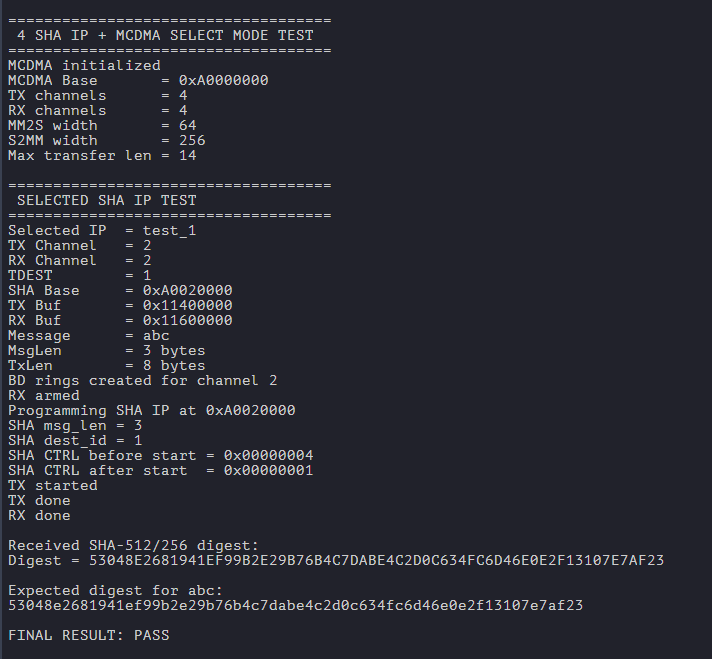

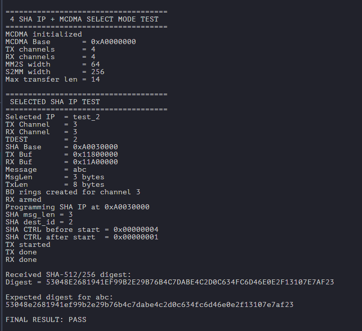

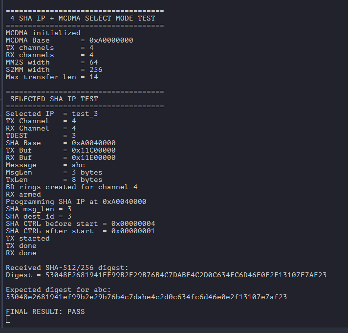

---

## Vivado Implementation Summary

The design was synthesized and implemented successfully.

| Report Item | Result |
|---|---|
| Synthesis | Complete |
| Implementation | Complete |
| Worst Negative Slack | `2.083 ns` |
| Total Negative Slack | `0 ns` |
| Failing Endpoints | `0` |
| Estimated On-Chip Power | `2.616 W` |

Reference image:

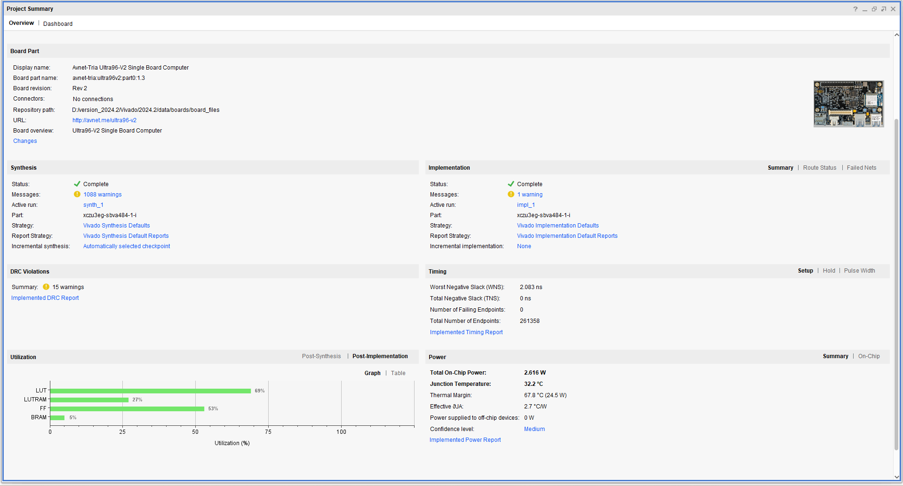

---

## Build and Run Flow

### 1. Vivado Hardware Flow

1. Open the Vivado project:

   ```text
   Vivado/project_1/project_1.xpr
   ```

2. Validate the block design.
3. Generate output products.
4. Run synthesis.
5. Run implementation.
6. Generate bitstream.
7. Export hardware with bitstream included.
8. Use the exported XSA in the Vitis platform.

### 2. Vitis Application Flow

For the API-based application:

```text
Application/app_component/src/
```

For the single-file application:

```text
Application_1/app_component/src/
```

Build and run steps:

1. Open Vitis Unified IDE.
2. Open or import the platform project.
3. Confirm that the XSA is selected correctly.
4. Build the platform.
5. Build the application component.
6. Program the FPGA.
7. Run the application on `psu_cortexa53_0`.
8. Open the serial terminal.

UART terminal settings:

```text
Baud rate    : 115200
Data bits    : 8
Parity       : None
Stop bits    : 1
Flow control : None
```

---

## Important Implementation Notes

- RX channel should be armed before starting the TX transfer.
- The `TDEST` value must match the selected SHA IP route in AXI4-Stream Switch 0.
- The selected TX channel and RX channel should match the intended SHA IP path.
- Cache flush/invalidate must be handled correctly for DMA buffers.
- TX stream width is 64-bit, so short input messages are padded or aligned to 8 bytes before transfer.
- RX stream width is 256-bit, matching the 32-byte SHA-512/256 digest size.
- Address mapping in Vitis must match the exported Vivado XSA.
- MCDMA buffer descriptors and data buffers should be placed in valid DDR memory regions.

---

## Troubleshooting

### DMA transfer timeout

Check the following:

- TX and RX channel IDs are correct.
- RX channel is started before TX.
- BD ring memory is valid and non-overlapping.
- Cache flush is done before TX.
- Cache invalidate is done before reading RX digest.
- AXI Stream Switch `TDEST` routing matches the selected SHA IP.

### Hash mismatch

Check the following:

- Input message length is programmed correctly.
- TX buffer padding/alignment is correct.
- Expected digest is for SHA-512/256, not SHA-256.
- RX buffer is invalidated before reading digest.
- Byte order is handled consistently in software.

### No UART output

Check the following:

- UART terminal baud rate is set to 115200.
- `standalone_stdin` and `standalone_stdout` are set to the selected PS UART in the Vitis platform configuration.
- Application is launched on `psu_cortexa53_0`.

---

## Performance Notes

This README only includes verified functional validation results. Throughput and latency numbers are not listed because they should be added only after measurement using a defined test method.

Suggested future measurements:

- Transfer time for different message sizes.
- Effective hashing throughput.
- DMA setup overhead per transfer.
- Latency comparison between single-IP and four-IP selected routing.
- Resource utilization comparison for different channel counts.

---

## References

- Xilinx Zynq UltraScale+ MPSoC documentation
- Xilinx AXI MCDMA product documentation
- Xilinx AXI4-Stream Switch product documentation
- Xilinx Vitis HLS documentation
- NIST FIPS 180-4 Secure Hash Standard
- Ultra96-V2 board documentation

---

## Author

**Nilesh1902**  
Hardware architecture, HLS IP integration, Vivado block design, Vitis application development, and hardware validation.

---

## Project Conclusion

The design successfully verifies four SHA-512/256 HLS IP instances using AXI MCDMA channel selection. Each IP was individually selected through the application, routed using AXI4-Stream `TDEST`, processed the input message `abc`, returned the correct 256-bit digest, and produced a final `PASS` result.

**Last Updated:** June 2026  
**Project Status:** Functional validation completed
